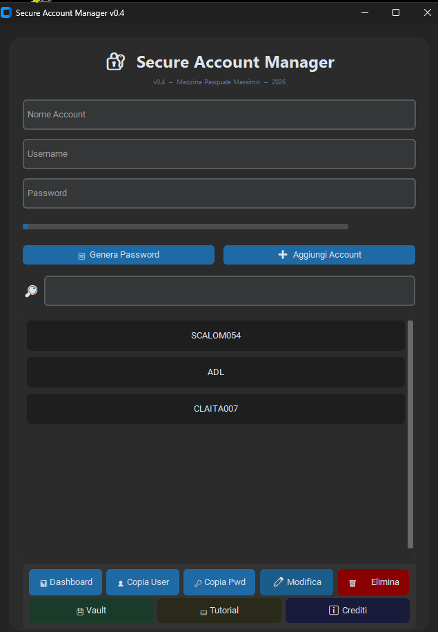
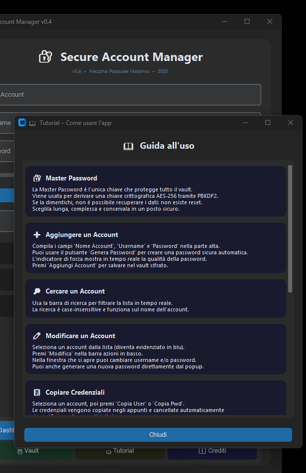

# 🔐 Account Security Manager


> Un password manager desktop sicuro, open source e facile da usare. Sviluppato in Python con interfaccia moderna grazie a CustomTkinter.

---

## 📸 Screenshot






---

## ✨ Funzionalità

- 🗂️ **Gestione account** — aggiungi, modifica ed elimina credenziali
- 🔍 **Ricerca rapida** — trova subito l'account che ti serve
- 📋 **Copia negli appunti** — con un click, senza esporre la password a schermo
- 🎨 **Interfaccia moderna** — tema scuro/chiaro con CustomTkinter
- 📐 **Layout responsivo** — griglia adattiva, funziona su qualsiasi risoluzione
- 💾 **Storage locale** — i tuoi dati restano sul tuo PC, nessun cloud
- 🔒 **Nessuna telemetria** — zero connessioni a server esterni

---

## 🛡️ Sicurezza e Trasparenza

Questo progetto è **completamente open source** per una ragione precisa: un password manager chiuso non merita fiducia.

- Il codice è **auditabile** da chiunque
- **Nessun dato** viene inviato a server esterni
- Le credenziali sono salvate **localmente** sul tuo dispositivo
- Puoi verificare tu stesso cosa fa ogni riga di codice

> 💡 Ispirato alla filosofia di KeePass e Bitwarden: la sicurezza vera nasce dalla trasparenza.

---

## 🚀 Installazione

### Opzione 1 — Eseguibile precompilato (consigliato)

Scarica l'ultima versione dalla pagina [**Releases**](../../releases):

| Sistema | File | Note |
|---------|------|------|
| Windows 10/11 | `AccountSecurity-windows.exe` | Firmato digitalmente |
| Linux (64-bit) | `AccountSecurity-linux` | Richiede `chmod +x` |

**Windows:** se appare un avviso di SmartScreen, clicca "Ulteriori informazioni" → "Esegui comunque". Il file è firmato e sicuro.

**Linux:**
```bash
chmod +x AccountSecurity-linux
./AccountSecurity-linux
```

---

### Opzione 2 — Da sorgente

**Requisiti:**
- Python 3.10 o superiore
- pip

```bash
# Clona il repository
git clone https://github.com/tuousername/account-security-manager.git
cd account-security-manager

# Installa le dipendenze
pip install -r requirements.txt

# Avvia l'applicazione
python main.py
```

---

## 🗂️ Struttura del progetto

```
account-security-manager/
├── main.py               # Entry point
├── requirements.txt      # Dipendenze Python
├── README.md
├── LICENSE
└── docs/
    └── screenshot_main.png
```

---

## 🔧 Dipendenze

| Libreria | Versione | Uso |
|----------|----------|-----|
| `customtkinter` | ≥ 5.0 | Interfaccia grafica |
| `pyperclip` | ≥ 1.8 | Copia negli appunti |

---

## 🤝 Contribuire

I contributi sono benvenuti! Se trovi un bug o hai un'idea:

1. Fai un **Fork** del repository
2. Crea un branch: `git checkout -b feature/nuova-funzionalita`
3. Fai commit: `git commit -m "Aggiunge nuova funzionalità"`
4. Push: `git push origin feature/nuova-funzionalita`
5. Apri una **Pull Request**

Per bug critici di sicurezza, apri una **Issue** con il tag `security`.

---

## ☕ Supporta il progetto

Account Security Manager è gratuito e open source. Se lo trovi utile, considera una piccola donazione per supportare lo sviluppo:

[](https://ko-fi.com/tuousername)
[](https://github.com/sponsors/tuousername)

---

## 📄 Licenza

Distribuito sotto licenza **MIT**. Vedi il file [LICENSE](LICENSE) per i dettagli.

---

## 👤 Autore

**Massimo** — [Accademia del Levante](https://accademiadellevante.it)

---

*Se questo progetto ti è stato utile, lascia una ⭐ su GitHub!*